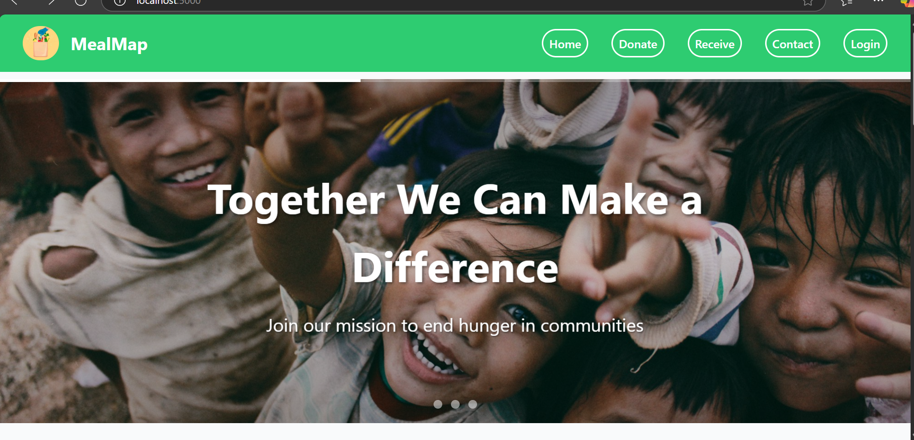
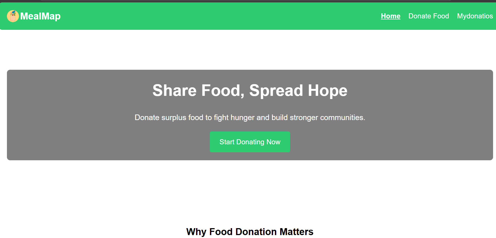

# MealMap
# 🥗 New Xhorizon – AI-Powered Food Donation & Rescue System

**New Xhorizon** is a web-based platform built to reduce food waste by connecting food donors (like restaurants or individuals) with nearby NGOs and people in need. It uses a geo-intelligent system to streamline donations, pickups, and feedback—all powered by a user-friendly interface.

🛠️ Built during **XHorizon Hackathon 2025** by Team ZeroWaste.

---

## 🚀 Features

- 👤 User registration for Donors, Receivers, and Admins
- 📍 Geo-location based food request matching
- 📝 Donation history and tracking
- 📷 Upload images of donations
- 🗣️ Feedback system
- 📊 Admin dashboard

---

## 🛠️ Tech Stack

- **Frontend**: HTML, CSS, JavaScript
- **Backend**: Node.js, Express.js
- **Database**: MongoDB
- **Templating**: EJS
- **Deployment**: GitHub + Vercel

---
## 👥 Contributors

- [Varun Koushik Palagani](https://github.com/Varun-1729)
- [Adithya](https://github.com/adithya23-git)
- [Contributor Name](https://github.com/username)
- [Another Contributor](https://github.com/username)

- ## 📸 Screenshots

### 🏠 Home Page

### 🍱 Donate Page

### 📥 Receiver Dashboard

